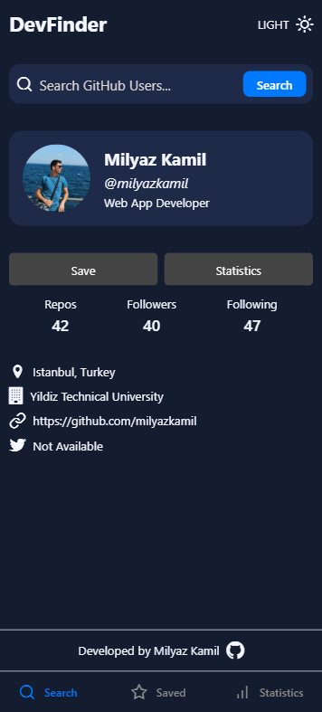
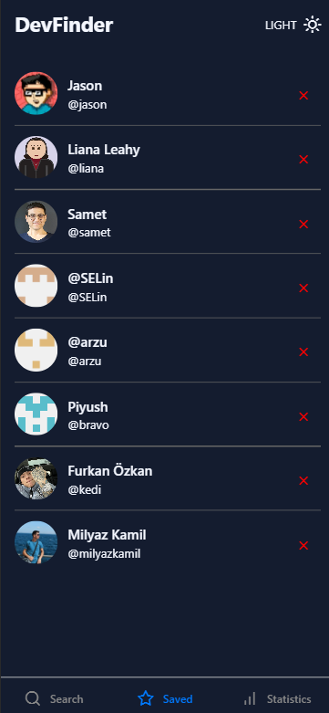
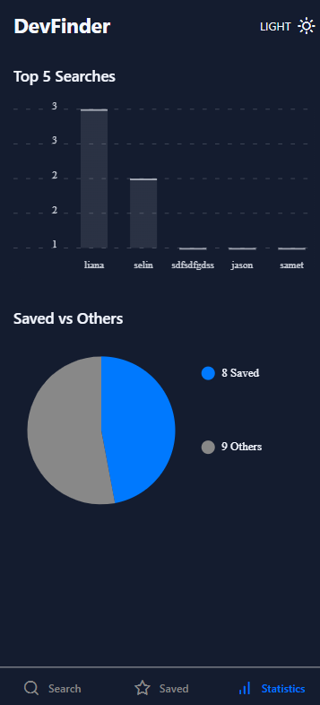

# DevFinder
<p align="center">
  
  
  
</p>

## Proje Açıklaması

**DevFinder**, Expo ve React Native kullanılarak geliştirilen, GitHub kullanıcılarını arama, kaydetme ve istatistiklerini gösterme özelliklerine sahip bir mobil uygulamadır. Uygulama:

* GitHub API'si üzerinden kullanıcı bilgisi çeker (profil, istatistik, konum, şirket vb.).
* Daha önce yapılan aramaları kaydeder ve en sık yapılan ilk 5 aramayı grafiksel olarak sunar.
* Kaydedilen kullanıcıları listeleyerek hızlı erişim sağlar.
* Kullanıcının yıllara göre oluşturduğu repoları ya da genel kaydedilen vs. diğerleri dağılımını grafiklerle görselleştirir.
* Açık/koyu tema desteği ile kullanıcı deneyimini özelleştirir.

## Kullanılan Teknolojiler ve API

* **React Native & Expo**: Mobil platformlarda hızlı geliştirme.
* **expo-router**: Sayfa yönlendirme için.
* **react-native-chart-kit**: Bar ve pasta grafiklerinin çizimi.
* **AsyncStorage** (React Native) ya da hook tabanlı `useSearchHistory` ve `useSavedUsers`: Arama geçmişi ve favori kullanıcıları kalıcı saklama.
* **GitHub REST API**: Kullanıcı verisi ve repo listesi çekme.
* **@expo/vector-icons**: Uygulama ikonları.

## Kurulum ve Çalıştırma

1. Depoyu klonlayın:

   ```bash
   git clone https://github.com/milyazkamil/DevFinder.git
   cd DevFinder
   ```
2. Bağımlılıkları yükleyin:

   ```bash
   npm install
   # veya
   yarn install
   ```
3. Uygulamayı çalıştırın:

   ```bash
   npx expo start
   ```
4. Emulator ya da gerçek cihazda Expo Go uygulamasıyla QR kodunu tarayın.

## Uygulama Kullanımı

* **Arama**: Üstteki arama çubuğuna GitHub kullanıcı adı girilip onaylandığında, profil bilgisi ekrana gelir.
* **Kaydet**: Profil kartındaki "Save" butonuna basarak kullanıcıyı favorilere ekleyebilirsiniz.
* **Kaydedilenler**: Alt menüde "Saved" sekmesinden favori listesine erişebilirsiniz.
* **İstatistikler**: "Statistics" sekmesinde en sık aranan 5 kullanıcı ve kaydedilen vs. diğerleri oranlarını görebilirsiniz.
* **Tema Değiştirme**: Başlık çubuğundaki LIGHT/DARK düğmesiyle renk temasını değiştirin.
---

**Not:** Herhangi bir sorun veya soru için GitHub Issues ya da e-posta yoluyla iletişime geçebilirsiniz.
